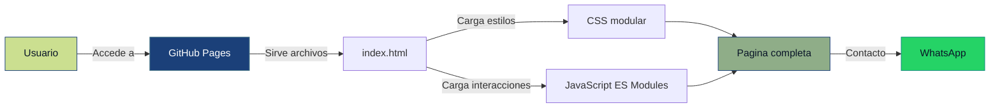

<div align="center">

# ADT - Agencia Digitalizadora Total

### Sitio web corporativo de servicios digitales

[](https://adtotalcol-star.github.io/ADT/)
[](https://adtotalcol-star.github.io/ADT/)
[](#licencia)

<br>

[](https://adtotalcol-star.github.io/ADT/)

</div>

---

## Descripcion del Proyecto

Plataforma web moderna para **ADT - Agencia Digitalizadora Total**. Presenta servicios de digitalizacion para negocios, facilita el contacto por WhatsApp y ofrece una experiencia clara, responsive y profesional con modo claro y oscuro.

El sitio esta enfocado en empresas, emprendimientos y marcas que necesitan fortalecer su presencia digital mediante paginas web, tiendas online, gestion de redes sociales y posicionamiento SEO.

---

## Caracteristicas Principales

- **Diseno moderno:** interfaz limpia, animaciones suaves y experiencia responsive para movil, tablet y escritorio.
- **Modo claro/oscuro:** selector de tema con preferencia guardada en el navegador.
- **Enfoque en conversion:** botones directos a WhatsApp y formulario conectado al numero comercial.
- **Servicios con detalle:** cada servicio abre un modal con informacion ampliada y CTA personalizado.
- **Identidad visual:** logo, favicon e iconos personalizados por servicio.
- **Codigo modular:** CSS y JavaScript separados por responsabilidades.

---

## Tecnologias Utilizadas

| Componente | Tecnologia |
|:---:|:---:|
| **Frontend** |    |
| **Estilos** |   |
| **Iconos** |   |
| **Tipografia** |  |
| **Hosting** |  |

---

## Diagrama de Funcionamiento



---

## Estructura del Proyecto

```text
ADT/
├── index.html              # Web principal
├── css/
│   ├── main.css            # Importa todos los estilos
│   ├── variables.css       # Colores, sombras y tema
│   ├── reset.css           # Estilos base
│   ├── layout.css          # Layout y responsive
│   ├── components.css      # Componentes UI
│   └── animations.css      # Animaciones
├── js/
│   ├── app.js              # Entrada principal
│   ├── modules/            # Modulos de secciones
│   └── utils/              # Utilidades visuales
├── components/             # Componentes HTML de referencia
├── img/                    # Logo y favicon
├── robots.txt              # Reglas para rastreadores
├── sitemap.xml             # Mapa del sitio para buscadores
├── site.webmanifest        # Configuracion web app / iconos
└── README.md               # Documentacion
```

---

## Ejecutar Localmente

```bash
python -m http.server 8000
```

Luego visita:

```text
http://localhost:8000
```

---

## SEO y Publicacion

- **URL publica:** `https://adtotalcol-star.github.io/ADT/`
- **Hosting:** GitHub Pages.
- **SEO base:** meta descripcion, canonical, Open Graph, Twitter Card, JSON-LD, favicon, `robots.txt` y `sitemap.xml`.
- **Arquitectura:** sitio sin framework y sin proceso de compilacion.

---

## Licencia

© 2026 ADT - Agencia Digitalizadora Total. Todos los derechos reservados.

<div align="center">
<br>
<p>Desarrollado para <strong>ADT - Agencia Digitalizadora Total</strong></p>
<p>
  <a href="https://adtotalcol-star.github.io/ADT/">Ver sitio web</a>
</p>
</div>
